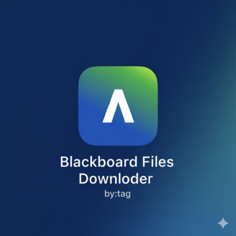
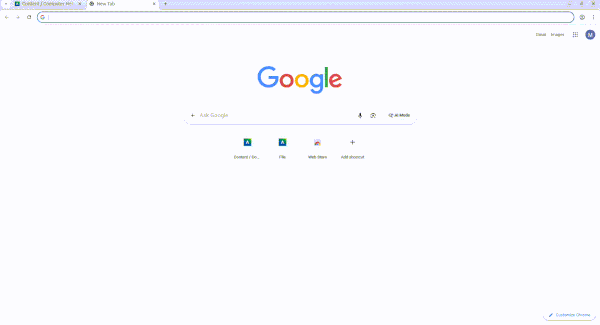

# Blackboard Files Downloader

A Chrome extension that automatically downloads files from Blackboard LMS with ONE SHOT.

## Demo

## Features

- Automatically detects files in Blackboard pages
- Downloads files with a single click
- Works with various Blackboard domains and installations
- Simple and intuitive user interface

## Installation

### Manual Installation (Developer Mode)

1. Download the latest release zip from [Releases](https://github.com/TAGOOZ/blackboard-downloader/releases) or clone this repository
2. Unzip the file
3. Open Chrome and go to `chrome://extensions/`
4. Enable "Developer mode" at the top right
5. Click "Load unpacked" and select the unzipped folder

## Usage

1. Navigate to any Blackboard page containing downloadable files
2. Click the extension icon in your browser toolbar
3. The extension will scan for available files
4. Click on files to download them

## Development

### Prerequisites

- Google Chrome or compatible browser
- Basic knowledge of HTML, CSS, and JavaScript

## Author

Mustafa Tag Eldeen
